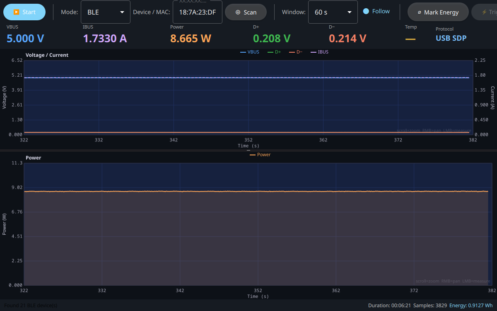
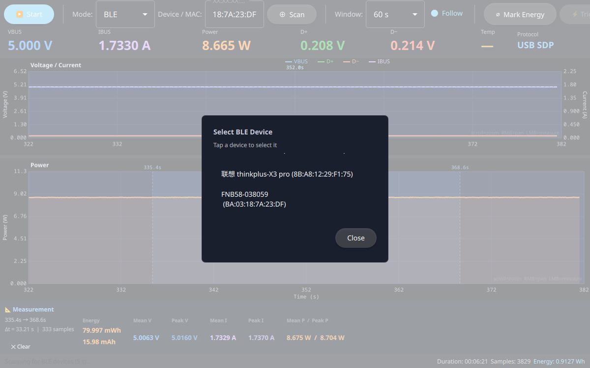
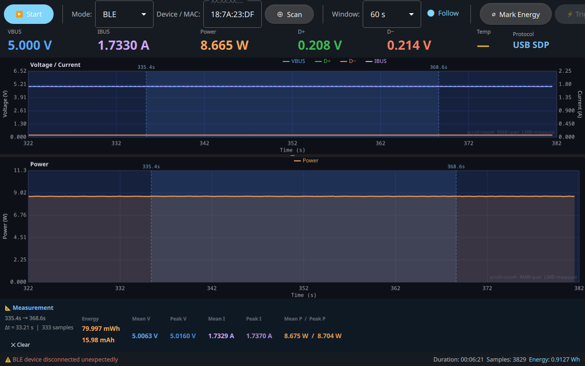
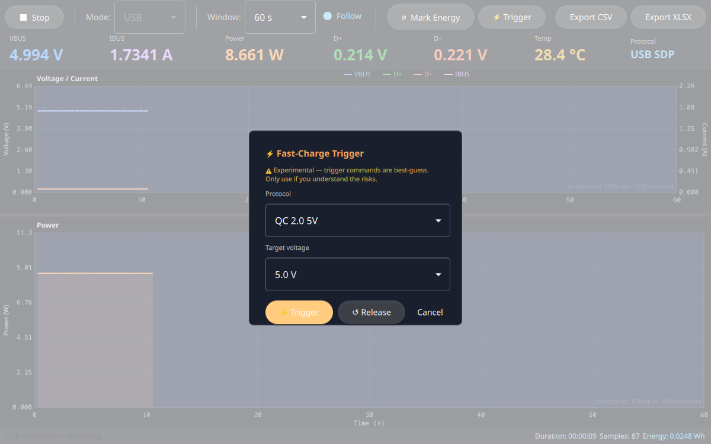

# OpenFNB58

Open-source tools for the **FNIRSI FNB58** USB power meter / charger tester.

**Author:** Libor Tomsik, OK1CHP

Includes a Python CLI reader and a Qt 6 / QML desktop application with live charts,
range measurement, protocol detection, fast-charge trigger, and CSV/Excel export.
Works on **Linux**, **Windows**, and **macOS** over **USB HID** or **Bluetooth LE**.

---

## Screenshots

**Live streaming over BLE — 5 V / 1.73 A, USB SDP detected**


**BLE device picker — scans for nearby FNB58 devices**


**📐 Range measurement — drag to select, stats panel slides up**


**⚡ Fast-charge trigger popup — select protocol and target voltage**


---

## Downloads

Pre-built binaries are attached to each [GitHub Release](https://github.com/yeckel/OpenFNB58/releases):

| Platform | File | Notes |
|----------|------|-------|
| Linux    | `OpenFNB58-linux-x86_64.AppImage` | `chmod +x`, then run |
| Windows  | `OpenFNB58-windows-x86_64.zip`    | Unzip and run `fnb58app.exe` |
| macOS    | `OpenFNB58-macos.dmg`             | Drag to Applications |

---

## Features

### Python CLI (`fnb58.py`)
- Reads live measurements over **USB HID** (`/dev/hidraw*`) or **Bluetooth LE**
- Reports VBUS, IBUS, Power, D+, D−, Temperature, **detected protocol**
- Fast-charge trigger: `--trigger PROTO_ID --voltage V` (experimental)
- No root required — uses `/dev/hidraw*` (world-accessible) and unprivileged D-Bus BLE
- Modes: single shot, continuous, with configurable interval

### Qt/QML GUI (`app/`)
- **Live scrolling charts** — Voltage/Current (dual axis) + Power (area fill)
- **Live readout bar** — VBUS, IBUS, Power, D+, D−, Temperature, **Protocol badge**
- **Protocol detection** — identifies USB SDP/DCP, QC 2.0/3.0, Apple, Samsung, Huawei FCP, USB PD from D+/D− voltages
- **Fast-charge trigger** — ⚡ Trigger button sends QC/FCP/SCP/PD trigger commands (experimental)
- **USB and BLE transport** — USB auto-connect; BLE scan popup picks from nearby devices
- **Range measurement** — click-drag on any chart to select a time window; shows energy (Wh/mWh/mAh), mean & peak V/I/P
- **Energy marker** — reset the Wh accumulator mid-session to measure a charging phase
- **Zoom & pan** — scroll wheel to zoom in/out, right-click drag to pan both charts
- **Export** — single **⬇ Export…** button, native OS save dialog, CSV and Excel (.xlsx) output
- Dark Material theme, configurable time window, follow mode
- Cross-platform: **Linux** (AppImage), **Windows** (zip), **macOS** (dmg)

---

## Hardware

| Property | Value |
|----------|-------|
| Device   | FNIRSI FNB58 |
| USB VID:PID | `2E3C:5558` |
| USB interface | HID (interface #3) → `/dev/hidraw*` |
| BLE services | `ffe0` (notify), `ffe5` (write) |
| BLE notify char | `ffe4` (in service `ffe0`) |
| BLE write char  | `ffe9` (in service `ffe5`) |

---

## Requirements

### Python CLI
- Python 3.8+
- `python3-dbus`, `python3-gi` (for BLE mode; system packages)
- User must be in the `plugdev` group (for `/dev/hidraw*` access)

```bash
sudo usermod -aG plugdev $USER   # re-login after
```

### Qt GUI
- **Qt 6.5+** with: Core, Gui, Quick, QuickControls2, QML, Widgets, Bluetooth (optional)
- CMake 3.28+, C++20 compiler
- **hidapi** — `libhidapi-dev` (Linux), `brew install hidapi` (macOS), bundled via vcpkg (Windows)

Tested with Qt 6.9.2 from the [Qt online installer](https://www.qt.io/download).

For BLE on Linux, BlueZ must be running and the device pre-paired:
```bash
bluetoothctl
  scan on
  pair BA:03:18:7A:23:DF
  trust BA:03:18:7A:23:DF
```

---

## Building from Source

```bash
cd app
cmake -B build -DCMAKE_BUILD_TYPE=Release .
cmake --build build --parallel
./build/bin/fnb58app
```

On Linux, Qt 6.9 from `/opt/Qt` is detected automatically if present.

---

## USB HID Protocol

The FNB58 uses 64-byte HID reports over `/dev/hidraw*`.

| Command | Bytes |
|---------|-------|
| INIT1   | `AA 81 00 … 8E` |
| INIT2   | `AA 82 00 … 96` |
| POLL    | `AA 83 00 … 9E` |

Response header: `AA 04`, followed by 4 × 15-byte samples.

| Field    | Offset | Type        | Scale     |
|----------|--------|-------------|-----------|
| Voltage  | 0      | uint32-LE   | ÷ 100000  |
| Current  | 4      | uint32-LE   | ÷ 100000  |
| D+       | 8      | uint16-LE   | ÷ 1000    |
| D−       | 10     | uint16-LE   | ÷ 1000    |
| Temp     | 12     | uint16-LE   | ÷ 10      |

## BLE Protocol

Stream frames on `ffe4`: `AA [type] [data_len] [data…] [checksum]`

| Type | Data | Content |
|------|------|---------|
| `07` | 4 B  | VBUS uint16-LE ÷ 1000, IBUS uint16-LE ÷ 1000 |
| `06` | 6 B  | D+ uint16-LE ÷ 1000, D− uint16-LE ÷ 1000 |

Initialisation sequence sent to `ffe9`:
1. `AA 81 00 F4` — wake
2. wait ~2 s
3. `AA 82 00 A7` — start stream

---

## Usage

### Python CLI

```bash
# Single reading (USB)
python3 fnb58.py --once

# Continuous USB monitoring (1 s interval)
python3 fnb58.py --usb --interval 1

# BLE monitoring (auto-detect MAC)
python3 fnb58.py --ble

# BLE with explicit MAC
python3 fnb58.py --ble --mac BA:03:18:7A:23:DF

# Send QC 2.0 9V trigger, hold 3 s, then release (proto id 2 = QC 2.0 9V)
python3 fnb58.py --trigger 2 --voltage 9 --hold 3
```

### Qt GUI

**USB mode:** select *USB*, leave Device/MAC blank, click ▶ Start.  
**BLE mode:** select *BLE*, click ⊕ Scan, pick your device, click ▶ Start.

#### Measurement
Click and drag on any chart to select a time range.  
A panel slides up showing energy, mean/peak voltage, current and power for the selection.  
Double-click or press **✕ Clear** to dismiss.

---

## Project Structure

```
OpenFNB58/
├── fnb58.py                  Python CLI (USB HID + BLE)
└── app/
    ├── CMakeLists.txt
    ├── build.sh
    ├── main.cpp
    ├── DataRecord.h           Measurement sample struct
    ├── BaseTransport.h        Abstract QThread transport
    ├── UsbTransport.h/cpp     USB HID worker (hidapi, cross-platform)
    ├── BleTransport.h/cpp     BLE worker (Qt Bluetooth, cross-platform)
    ├── DeviceBackend.h/cpp    QML-exposed backend (energy, export, measure)
    ├── XlsxWriter.h/cpp       OOXML .xlsx writer (no external deps)
    ├── ZipWriter.h/cpp        STORE-only ZIP (used by XlsxWriter)
    └── qml/
        ├── Main.qml           Application window, toolbar, stats panel
        └── LiveChart.qml      Canvas-based scrolling dual-axis chart
```

---

## Acknowledgements

- Protocol reverse-engineered with help from
  [baryluk/fnirsi-usb-power-data-logger](https://github.com/baryluk/fnirsi-usb-power-data-logger)
  and [Boondock-Echo/Article-Files](https://github.com/Boondock-Echo/Article-Files/tree/main/FNIRSI-FNB58).

## License

[GNU General Public License v3.0](LICENSE) — see `LICENSE` for full terms.

Copyright © 2024–2026 Libor Tomsik, OK1CHP

